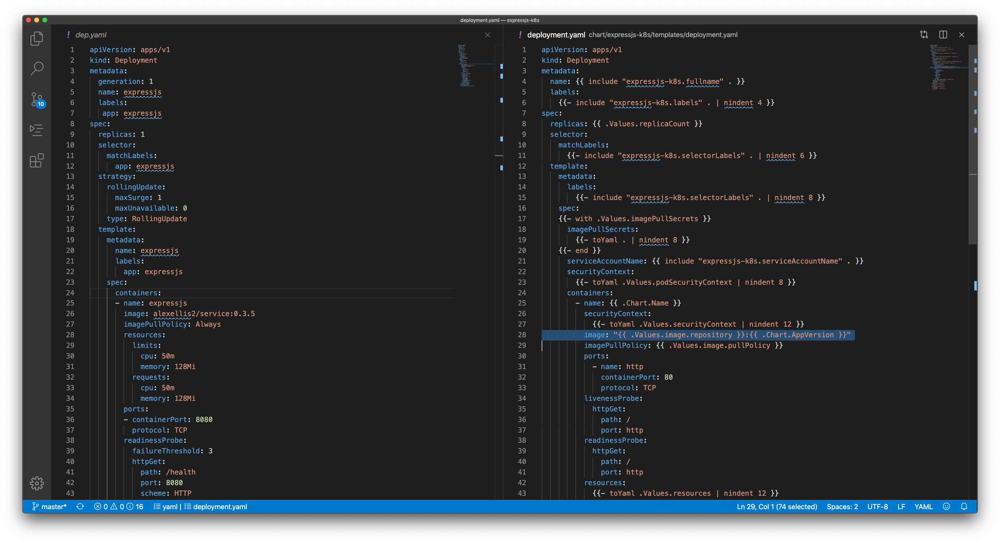

In this guide you'll learn how to create a Helm Chart with Helm 3 for an [Express.js](https://expressjs.com) microservice.

Developers adopting Kubernetes often turn to helm to find pre-packaged software with a single command. Software is packaged in charts which allows for customization at install time and for lifecycle management such as upgrades and removal of software.

## Helm 2 is dead, long live Helm 3!

Up until recently Helm 2 also shipped with a server side component called `tiller`. Unfortunately `tiller` was insecure by default and left many clusters vulnerable to attach. Steps were published by the project maintainers to manually lock-down access, but it was too late and so there is now a mix of helm lovers and haters in the world.

Helm 3 aims to consolidate developers by simply removing the `tiller` component all together. The logic that controlled updates and removal is now run at the client-side and only minimal state is retained with the cluster. In this guide we'll be using helm 3, but if you have to use helm 2 for some reason, then the steps will be largely the same.

## The guide

In this guide we'll add a helm 3 chart to the express.js sample application which has two routes - one to render a webpage and one to render links from a JSON API call.

This sample application was used in a previous guide: [Get a TLS Certificate For Your Application With JetStack's Cert-Manager](https://www.civo.com/learn/get-a-tls-certificate-for-your-application-with-jetstack-s-cert-manager). Today's guide differs in that we'll focus primarily on packaging the application with Helm and will skip the production deployment and domain-name configuration.

### Get a Kubernetes cluster

If you're a part of the [#KUBE100 program](https://www.civo.com/blog/kube100-is-here), then create a new cluster in your Civo dashboard and configure your `kubectl` to point at the new cluster.

Alternatively, you can use any other Kubernetes cluster, or if you are on Civo already but not in #KUBE100, then create a new Small or Medium Instance, then use [k3sup ('ketchup')](https://k3sup.dev) to install k3s.

Check that you are pointing at the correct cluster before continuing:

```
kubectl config get-contexts
```

### Get helm3

If you're using MacOS or Linux simply run the below:

```sh
curl https://raw.githubusercontent.com/helm/helm/master/scripts/get-helm-3 | bash
```

If you're a Windows user, then install [Git Bash](https://git-scm.com/downloads) and then run the above in a new terminal.

Check the installation:

```sh
$ helm version
version.BuildInfo{Version:"v3.0.0", GitCommit:"e29ce2a54e96cd02ccfce88bee4f58bb6e2a28b6", GitTreeState:"clean", GoVersion:"go1.13.4"}
```

Search for a chart:

```sh
$ helm search hub prometheus-operator

URL                                               	CHART VERSION	APP VERSION	DESCRIPTION                                       
https://hub.helm.sh/charts/stable/prometheus-op...	8.2.4        	0.34.0     	Provides easy monitoring definitions for Kubern...
https://hub.helm.sh/charts/bitnami/prometheus-o...	0.4.0        	0.34.0     	The Prometheus Operator for Kubernetes provides...
```

You'll notice that sometimes there are various versions of a chart. The `stable` repository is generally the `upstream` or main choice that you'll want.

It turns out that the helm team decided to remove the `stable` repository which was generally used to install charts. Let's add it back in:

```
helm repo add stable https://kubernetes-charts.storage.googleapis.com
helm repo update
```

Now install a chart for `postgresql` which is part of the `stable` repo:

View the [Chart README](https://github.com/helm/charts/tree/master/stable/postgresql) to find out what options are available.

```sh
helm upgrade --install postgresql stable/postgresql --set persistence.enabled=false
```

I'm setting `persistence.enabled=false` so that no volumes will be created, we don't need them for testing.

Try the chart:

```
To get the password for "postgres" run:

    export POSTGRES_PASSWORD=$(kubectl get secret --namespace default postgresql -o jsonpath="{.data.postgresql-password}" | base64 --decode)

To connect to your database run the following command:

    kubectl run postgresql-client --rm --tty -i --restart='Never' --namespace default --image docker.io/bitnami/postgresql:11.6.0-debian-9-r0 --env="PGPASSWORD=$POSTGRES_PASSWORD" --command -- psql --host postgresql -U postgres -d postgres -p 5432
```

Create a table and select from it:

```
postgres=# create table tester (name int)   
select * from tester;
```

Remove the chart

```
helm delete postgresql
```

### An introduction to Helm templating

* Fork the code here: [alexellis/expressjs-k8s](https://github.com/alexellis/expressjs-k8s)

We already have some static YAML manifests in the repository, but helm allows us to use [Golang's template language](https://golang.org/pkg/text/template/https://golang.org/pkg/text/template/) to replace values at deployment time.

For me, templating is a core part of the value of helm. Let's look at why we need it.

Here's an ingress file that has a hard-coded hostname of the website users will navigate to, in order to see our code. 

```yaml
apiVersion: extensions/v1beta1
kind: Ingress
metadata:
  annotations:
    kubernetes.io/ingress.class: nginx
  creationTimestamp: null
  generation: 1
  labels:
    app: expressjs
  name: expressjs
  namespace: openfaas-fn
spec:
  rules:
  - host: express.example.com
    http:
      paths:
      - backend:
          serviceName: expressjs
          servicePort: 8080
        path: /
```

Users now need to fork our YAML files and maintain their own version, or they have to edit just before deploying. Neither of these scenarios are ideal.

Let's try a template?

Before

```yaml
  - host: express.example.com
```

After

```yaml
  - host: express.{{.Values.domain}}
```

Templates can be overridden in two ways:

* By defining a `values.yaml`

```
domain: example.com
```

* Or by passing a flag at install time: `--set domain=example.com`

Civo has chosen to use Traefik as an IngressController instead of the more common Nginx, this is because k3s ships with it by default. There are pros and cons to a broad eco-system and to competition within the Cloud Native Computing Foundation - on the one hand we have choice, but on the other we have configuration.

We now need to add a new template for the IngressController to change between `nginx` and `traefik` for different users and environments:

Before:

`kubernetes.io/ingress.class: nginx`

After:

`kubernetes.io/ingress.class: {{.IngressClass}}`


### Create your chart

Remove any sample / pre-made charts with:

```
cd expressjs-k8s
rm -rf chart
```

Now create your own:

```sh
mkdir chart
cd chart

helm create expressjs-k8s
```

You'll get some sample files you can edit:

```sh
.
└── expressjs-k8s
    ├── Chart.yaml
    ├── charts
    ├── templates
    │   ├── NOTES.txt
    │   ├── _helpers.tpl
    │   ├── deployment.yaml
    │   ├── ingress.yaml
    │   ├── service.yaml
    │   ├── serviceaccount.yaml
    │   └── tests
    │       └── test-connection.yaml
    └── values.yaml

4 directories, 9 files
```

### Update the chart

The chart comes with samples that we can edit. Your task is now to translate our plain YAML files with hard-coded values into the sample templates that were provided via `helm create`.

We have 5 files in our plain YAMLs:
```
├── clusterissuer.yaml
├── dep.yaml
├── ingress-inlets.yaml
├── ingress.yaml
└── svc.yaml

0 directories, 5 files
```

Start with the dep.yaml which adds the Kubernetes Deployment, then work your way through each of the other files.

The generated templates do come with some values already set for us, so we just need to fill in or update the remaining entries. I find Visual Studio Code useful for this and I open the plain YAML on the left and then the templated file on the right.



I've highlighted the `image:` name which corresponds to the Docker image. This has been templated automatically, but before we used a hard-coded value in our YAML file. Remember that templated values come from one or two places: either `--set` command-line variables or `values.yaml`

Open `values.yaml` and start customising it as you go along.

```yaml
replicaCount: 1

image:
  repository: nginx
  pullPolicy: IfNotPresent

imagePullSecrets: []
nameOverride: ""
fullnameOverride: ""

serviceAccount:
  create: true
  name:

podSecurityContext: {}

securityContext: {}
service:
  type: ClusterIP
  port: 80

ingress:
  enabled: false
  annotations: {}
  hosts:
    - host: chart-example.local
      paths: []
  tls: []
resources: {}
nodeSelector: {}

tolerations: []

affinity: {}
```

If this all feels overwhelming, take courage, Kubernetes is a very complex system and it does take time to master. Begin today with your first chart, and after a few of them, it should become easier for you.

After installation the NOTES.txt file will print out some hints on how to use the service, you can customise this with Go templates or simply remove it if it's a bit too much to take on. In the postgresql example it was the NOTES.txt file which instructed us how to connect to postgres.

### Test our chart

Charts can be published to either an S3 bucket or a GitHub repository using GitHub pages, but before that we need to test that everything operates as expected.

```
$ cd chart

$ helm upgrade --install test-app expressjs-k8s
Release "test-app" has been upgraded. Happy Helming!
NAME: test-app
LAST DEPLOYED: Thu Nov 28 11:59:16 2019
NAMESPACE: default
STATUS: deployed
REVISION: 6
NOTES:
Check the deployment status:

  kubectl rollout status -n default deploy/test-app-expressjs-k8s

Now port-forward the service to test it out:

  kubectl port-forward -n default deploy/test-app-expressjs-k8s 8088:8080 &

Try to connect with a browser:

  http://127.0.0.1:8088
```

You can see that I updated NOTES.txt to print out some useful hints on how to test the application.


You can run this command as many times as you need until everything works exactly as you expected it to.

#### Test our chart with ingress

Now you can test the chart with ingress, which is what we looked at earlier. We needed a way to dynamically switch the domain name and the IngressController.

We can do this via `--set` override or by editing `values.yaml`.

For example you can enable ingress like this:

```
helm upgrade --install test-app expressjs-k8s --set ingress.enabled=true
```

Let's edit the `values.yaml` file instead:

```yaml
ingress:
  enabled: false
  annotations:
    kubernetes.io/ingress.class: traefik
  hosts:
    - host: expressjs.local
      paths: ["/"]
  tls: []
```

Now run:

```
helm upgrade --install test-app expressjs-k8s

# Get Ingress records:

kubectl get ingress -o wide --all-namespaces

NAMESPACE   NAME                     HOSTS                 ADDRESS        PORTS   AGE
default     test-app-expressjs-k8s   expressjs.local       172.31.2.148   80      59s
```

You could go and buy a domain-name and then set up a proper DNS entry, but for testing purposes we can make that easier. Find the public DNS entry for your Civo cluster, or the IP of one of the nodes in the cluster through your dashboard.


The value I saw was: `fce0cc8e-839e-475c-9845-d79487ab9fe4.k8s.civo.com`.

Now we can use our IngressController to test out the Ingress record created by the helm chart.

```sh
curl http://fce0cc8e-839e-475c-9845-d79487ab9fe4.k8s.civo.com/ -H "Host: expressjs.local"
```

We can also access the API this way:

```sh
curl http://fce0cc8e-839e-475c-9845-d79487ab9fe4.k8s.civo.com/links -H "Host: expressjs.local"

[{"name":"github","url":"https://github.com/alexellis"},{"name":"twitter","url":"https://twitter.com/alexellisuk"},{"name":"blog","url":"https://blog.alexellis.io"},{"name":"sponsors","url":"https://github.com/users/alexellis/sponsorship"}]
```

If you do actually want to create a real domain for this service, just register a domain and add a DNS CNAME or A entry to the DNS name or IP address of your Kubernetes cluster. For more help, please feel free to reach out to the team on Slack.

### Publish your chart

The next step after creating a useful application is for you to publish that so that other users or other team-members can consume the chart.

The two most popular options are:

* s3 - s3 isn't completely free, but is very convenient if you're an AWS customer
* GitHub pages - GitHub pages is free and you can publish a public chart very easily.

Add a `docs` folder with `mkdir -p docs`

Add a `Makefile`:

```makefile
.PHONY
charts:
	cd chart && helm package expressjs-k8s/
	mv chart/*.tgz docs/
	helm repo index docs --url https://alexellis.github.io/expressjs-k8s/ --merge ./docs/index.yaml
```

Replace `alexellis` with your username and `expressjs-k8s` with your repo and helm chart name.

Now generate your charts:

```
$ make charts

Successfully packaged chart and saved it to: /Users/alex/go/src/github.com/alexellis/expressjs-k8s/chart/expressjs-k8s-0.1.0.tgz
mv chart/*.tgz docs/
helm repo index docs --url https://alexellis.github.io/expressjs-k8s/ --merge ./docs/index.yaml
```

View the output:

```sh
docs/
├── expressjs-k8s-0.1.0.tgz
└── index.yaml

0 directories, 2 files
```

Add the files and do a commit, then push up to GitHub.

Now we need to enable GitHub pages to publish the docs folder via the Settings page for your repo.


Now we can remove our testing app and in the next step we can install it from the published repository.

```
helm delete test-app
```

### Install the chart from the repo

You can now add instructions for how other users should consume your chart.

```
# First they add the helm repo
helm repo add expressjs-k8s https://alexellis.github.io/expressjs-k8s/

# Then they run an update
helm repo update

# And finally they install
helm install test-app expressjs-k8s/expressjs-k8s
```

### Keep your chart updated

Every time you update your chart, you must edit the Chart.yaml file and bump up the version, this is so that when you run `make charts` a new version of the chart can be generated. If you bypass this step then clients won't know if they can upgrade or not.

Edit `Chart.yaml` and set `version: 0.1.0` to `version: 0.1.1`.

Now run `make charts`, do a git commit and push that up to the origin.

You can now run `helm repo update` and check that the version of the chart was updated:

```
$ helm show chart expressjs-k8s/expressjs-k8s

apiVersion: v2
appVersion: 1.16.0
description: A Helm chart for Kubernetes
name: expressjs-k8s
type: application
version: 0.1.1
```

Now you can update your installation with: `helm upgrade test-app expressjs-k8s/expressjs-k8s` and a new version of the code will be downloaded.

## Wrapping up

We started off with plain Kubernetes YAML manifest files with hard-coded values for the Docker image and IngressController type and domain-name. By installing helm 3 and applying Golang templates we were able to make the chart more versatile and flexible. After publishing the chart to GitHub Pages we then were able to share the chart with other users and publish version updates.

It's important to add a good README.md file which explains each `--set` override that's available and what users are likely to want to tweak.

Two of the charts I maintain on a regular basis are included below for your perusal:

* [OpenFaaS - Serverless-style applications on Kubernetes made simple](https://github.com/openfaas/faas-netes/tree/master/chart/openfaas)
* [inlets-operator - automate reverse proxy tunnels to expose in-cluster services on the Internet](https://github.com/inlets/inlets-operator/tree/master/chart/inlets-operator)

You may also find that some Helm charts are not yet ready for Helm 3 and still need to be installed with Helm 3. Over time I would expect all charts to be migrated over, but since Helm 3 only went GA at KubeCon in November 2019, it's still early days. One of the original Helm founders [(Rimas Mocevicius)](https://rimusz.net) wrote a plugin called [helm-2to3](https://helm.sh/blog/migrate-from-helm-v2-to-helm-v3/) which can help you migrate charts that are lagging behind.

Additional information and links

* Docs: [Helm 3 - charts, blog posts and documentation](https://helm.sh)
* Docs: [Express.js microservice framework for node.js](https://expressjs.com)
* Tool: [k3sup ('ketchup') - bootstrap k3s and helm charts with ease](https://github.com/alexellis/k3sup)

You can also [apply for the #KUBE100 program](https://www.civo.com/blog/kube100-is-here) if you'd like to try [Managed k3s](https://blog.alexellis.io/the-worlds-first-managed-k3s/).
